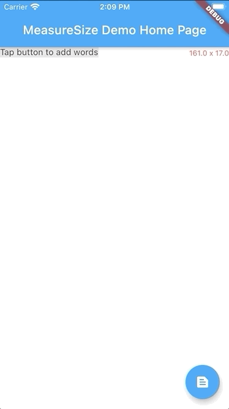

# measure_size

A Flutter package for efficiently measuring widget sizes and building size-aware, adaptive layouts with minimal overhead.

---

### Measuring text and drawing an overlay with matching size


---

| | `MeasureSize` | `MeasureSizeBuilder` |
|---------|-------------------|--------------|
| **Purpose** | Monitor size changes | Prototype-driven layout |
| **Callback timing** | Post-frame | During layout (`invokeLayoutCallback`) |
| **Measurements** | Single widget | Multiple prototypes |
| **Use case** | Reactive to size changes | Proactive layout decisions |
| **Complexity** | Simple | Advanced |
| **Performance** | Good | Excellent (single pass)
| **PreferredSizeWidget limitation** | Does not work | First frame problematic

---

```dart
import 'package:measure_size/measure_size.dart';

Widget child = Text('Lorem ipsum dolor sit amet');

MeasureSize(
    onChange: (Size newSize) {
        /// [newSize] will be the displayed size of [Widget child]
    },
    child: child,
);

MeasureSizeBuilder<String>(
    prototypeConstraints: (constraints) => BoxConstraints(
      minWidth: 0,
      maxWidth: constraints.maxWidth,
      minHeight: 0,
      maxHeight: double.infinity,
    ),
    prototypes: [
      PrototypeId(
        id: 'lorem',
        child: child,
      ),
    ],
    builder: (context, sizes) {
      // [sizes['lorem']] will be the layed out size of [Widget child]
      return child;
    }
);
```
---

## `MeasureSize`

#### __Required__
- **`Widget child`** - This widget will be displayed and and measured.

#### __Optional__
- **`void onChange(Size newSize)`** - A callback that is fired exactly once after the first frame of the child widget is rendered.

---

## `MeasureSizeBuilder<T>`

#### __Required__
- **`List<PrototypeId<T>> prototypes`** - Wrap widgets you'd like to measure with `PrototypeId` and provide a unique identifier for each widget.
- **`PrototypeWidgetBuilder<T> builder`** - A builder function that contains the sizes of all `prototypes`.
- **`PrototypeConstraintCalculator prototypeConstraints`** - Constraints to be assigned to each prototype widget.

## Example

A demonstration can be found in the `example` directory. To run the example:

`flutter run example/main.dart`


## Credits
- Thanks to [@jacksonrl](https://github.com/jacksonrl) for [the prototype solution](https://github.com/flutter/flutter/issues/14488#issuecomment-3651773365)
- Thanks to [Gene Bo](https://stackoverflow.com/users/2162226/gene-bo) and [Dev Aggarwal](https://stackoverflow.com/users/7061265/dev-aggarwalTaken) for this code in a stackoverflow answer: https://stackoverflow.com/a/60868972
